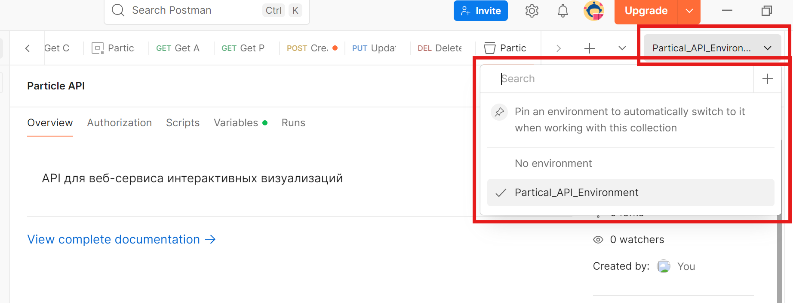
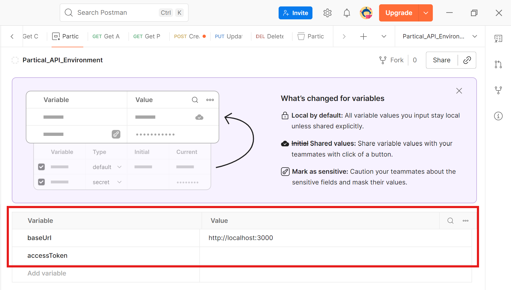

# Postman коллекция для Particle API

## Импорт коллекции

1. Открой Postman
2. Нажми `Import` - `Upload Files`
3. Выбери файл `Postman_collection.json`

## Настройка окружения

Коллекция использует переменные окружения. Создай новое окружение:

1. В Postman, в правом верхнем углу, нажми `Environments` → `Create new environment`
2. Назови его `Partical_API_Environment`
3. Добавь переменные:

| Переменная | Значение | Описание |
|:-----------|:---------|:---------|
| `baseUrl` | `http://localhost:3000` | Адрес запущенного сервера |
| `accessToken` | (оставь пустым) | Будет заполнен автоматически после логина |

4. Нажми `Save`

## Использование

1. Выбери созданное окружение `Particle API Local`
2. Выполни запросы в следующем порядке:

| Порядок | Запрос | Что происходит |
|:--------|:-------|:---------------|
| 1 | `Auth → Register` | Регистрация пользователя `test@example.com` |
| 2 | `Auth → Login` | Вход, токен автоматически сохраняется в `accessToken` |
| 3 | `Users → Get Current User` | Получение профиля текущего пользователя |
| 4 | `Presets → Create Preset` | Создание нового пресета |
| 5 | `Presets → Get All Presets` | Получение списка пресетов |
| 6 | `Presets → Get Preset By ID` | Получение пресета по ID |
| 7 | `Presets → Update Preset` | Обновление пресета |
| 8 | `Presets → Delete Preset` | Удаление пресета |

## Примечания

- Токен `accessToken` устанавливается автоматически после успешного логина (есть скрипт в Auth Login для этого)
- Все последующие запросы к защищённым эндпоинтам используют этот токен
- При перезапуске Postman токен нужно обновить — выполни `Login` заново
