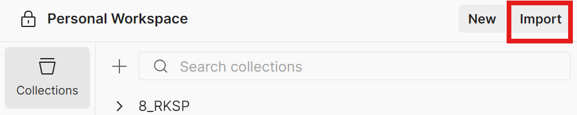

# Postman коллекция для Particle API

Коллекция для тестирования API веб-сервиса интерактивных визуализаций.

## Файлы

- `Particle_API.postman_collection.json` - коллекция запросов
- `Particle_API_Environment.json` - пример окружения (можно импортировать)

## Импорт коллекции

1. Открой Postman
2. Нажми `Import` - `Upload Files`
3. Выбери файл `Particle_API.postman_collection.json`

## Настройка окружения

Коллекция использует переменные окружения. Создай новое окружение:

1. В Postman, в правом верхнем углу, нажми `Environments` - `Create new environment`
2. Назови его `Particle_API_Environment`
3. Добавь переменные:

| Переменная | Значение | Описание |
|:-----------|:---------|:---------|
| `baseUrl` | `http://localhost:3000` | Адрес запущенного сервера |
| `accessToken` | (оставь пустым) | Заполняется автоматически после логина |
| `presetId` | (оставь пустым) | Заполняется автоматически после создания пресета |
| `commentId` | (оставь пустым) | Заполняется автоматически после создания комментария |

4. Нажми `Save`

## Использование

1. Выбери созданное окружение `Particle_API_Environment`
2. Выполни запросы в следующем порядке:

| Порядок | Запрос | Что происходит |
|:--------|:-------|:---------------|
| 1 | `Auth - Register` | Регистрация пользователя `test@example.com` |
| 2 | `Auth - Login` | Вход, токен сохраняется в `accessToken` |
| 3 | `Users - Get Current User` | Получение профиля |
| 4 | `Presets - Create Preset` | Создание пресета, ID сохраняется в `presetId` |
| 5 | `Presets - Get My Presets` | Получение списка пресетов |
| 6 | `Presets - Get Preset By ID` | Получение пресета по ID - (записывается просмотр) |
| 7 | `Presets - Update Preset` | Обновление пресета |
| 8 | `Presets - Make Preset Public` | Публикация пресета |
| 9 | `Presets - Get Public Feed` | Просмотр ленты публичных пресетов |
| 10 | `Likes - Like Preset` | Поставить лайк |
| 11 | `Comments - Create Comment` | Добавить комментарий, ID сохраняется в `commentId` |
| 12 | `Comments - Get Comments` | Получить комментарии |
| 13 | `Comments - Update Comment` | Обновить комментарий |
| 14 | `Comments - Delete Comment` | Удалить комментарий |
| 15 | `Likes - Unlike Preset` | Убрать лайк |
| 16 | `Presets - Delete Preset` | Удалить пресет |

## Примечания

- Токен `accessToken` устанавливается автоматически после успешного логина
- `presetId` и `commentId` заполняются автоматически при создании
- Все последующие запросы к защищённым эндпоинтам используют токен
- При перезапуске Postman токен нужно обновить - выполни `Login` заново